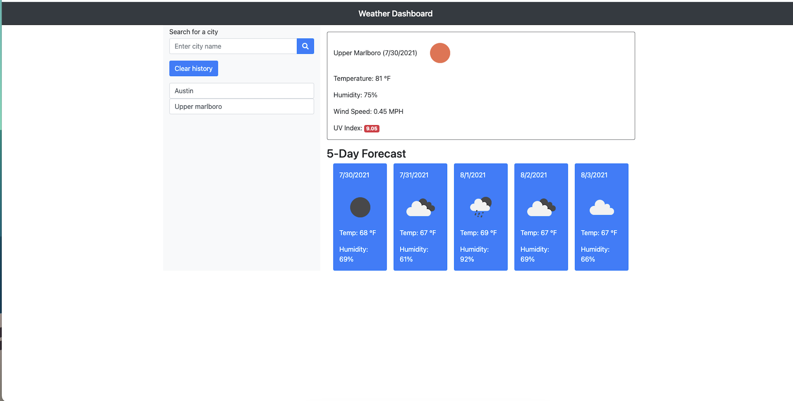

# weather_dashboard

# Table of Contents

- [Description](#description)
- [Visuals](#visuals)
- [Installation](#installation)
- [User_Story](#user_story)
- [Usage](#usage)
- [Links](#links)

## Description

This app uses the OpenWeather Weather Third-party API to access data on the current weather and 5-Day forcast for any city. Developers are often tasked with retrieving data from another application's API and using it in the context of their own. The weather dashboard that will run in the browser and feature dynamically updated HTML and CSS.

## Visuals 

 

## Installation 

The weather dashboard that will run in the browser and feature dynamically updated HTML and CSS.

## User_Story

AS A traveler
I WANT to see the weather outlook for multiple cities
SO THAT I can plan a trip accordingly

## Usage

GIVEN a weather dashboard with form inputs
WHEN I search for a city
THEN I am presented with current and future conditions for that city and that city is added to the search history
WHEN I view current weather conditions for that city
THEN I am presented with the city name, the date, an icon representation of weather conditions, the temperature, the humidity, the wind speed, and the UV index
WHEN I view the UV index
THEN I am presented with a color that indicates whether the conditions are favorable, moderate, or severe
WHEN I view future weather conditions for that city
THEN I am presented with a 5-day forecast that displays the date, an icon representation of weather conditions, the temperature, and the humidity
WHEN I click on a city in the search history
THEN I am again presented with current and future conditions for that city

## Links

https://github.com/Jashawns/weather_dashboard

